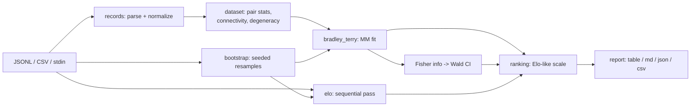

# duelo

[English](README.md) | [中文](README.zh.md) | [日本語](README.ja.md)

[](LICENSE) [](CHANGELOG.md) [](pyproject.toml)  [](CONTRIBUTING.md)

**ペアワイズ選好ログから信頼区間つきの Bradley-Terry / Elo ランキングを計算するオープンソースツール——ホスト型アリーナではなく、自分のデータの上でオフラインにランキングの数学を回す。**


```bash
git clone https://github.com/JaydenCJ/duelo && cd duelo && pip install -e .
```

> **プレリリース：** duelo はまだ PyPI に公開されていません。初回リリースまでは [JaydenCJ/duelo](https://github.com/JaydenCJ/duelo) をクローンし、リポジトリのルートで `pip install -e .` を実行してください。ランタイム依存ゼロなので、何もインストールせず `PYTHONPATH=src python3 -m duelo` でも動きます。

## なぜ duelo？

どのチームも社内でアリーナ式のペアワイズ比較を回しています——モデル A 対モデル B、プロンプト v1 対 v2、審判は人間か LLM。しかしそのログを正しくランキングに変えている人はほとんどいません：勝率の単純平均は対戦相手を無視し、逐次 Elo スクリプトは行の順序次第で答えが変わり、信頼区間のないリーダーボードはデータが支えられない意思決定を招きます。正しい道具は本物の不確実性つき Bradley-Terry 最尤推定ですが、そこに辿り着くには大抵アリーナ系リポジトリから numpy/scipy ノートブックを写す羽目になります。duelo はその数学を依存ゼロの単一 CLI にしたものです：JSONL か CSV のログを指せば、解析的または bootstrap の信頼区間つきの読みやすいリーダーボードが得られ、データがそもそもランキングを支えられないとき（完封、比較グラフの非連結）は大きな声で教えてくれます。

|  | duelo | choix | arena notebooks | trueskill |
|---|---|---|---|---|
| レーティングの信頼区間 | Yes (Wald + bootstrap) | No | Bootstrap (notebook code) | Per-player σ, not a CI |
| ログ全体での順序非依存フィット | Yes (BT MLE) | Yes (BT MLE) | Yes | No (sequential updates) |
| フィット健全性チェック（完封・非連結グラフ） | Yes, typed errors + fix hint | No (silent divergence) | No | n/a |
| 可読/markdown/JSON 出力の CLI | Yes | No (library only) | No (notebooks) | No (library only) |
| ランタイム依存 | 0 | numpy, scipy | pandas, numpy, plotly, ... | 0 |

<sub>依存数は 2026-07 時点で宣言されているランタイム要件：choix 0.3.5（numpy、scipy）。"arena notebooks" はアリーナ式リーダーボードに付属して公開される分析スクリプト群を指し、pandas/numpy/plotly スタックが前提です。duelo の数字は [pyproject.toml](pyproject.toml) の `dependencies = []` に対応します。</sub>

## 特徴

- **閉形式解で検証された正しい数学** —— Bradley-Terry は Hunter の MM アルゴリズム、引き分けは各側 0.5 勝として計上、構造的に順序非依存；2 アイテムのフィットと均衡戦績の標準誤差は厳密な解析値に対してテスト済み。
- **2 種類の信頼区間** —— 観測 Fisher 情報量による解析的 Wald 区間（高速・対称）、またはシードつきパーセンタイル bootstrap（非対称、小標本の歪みを捉える）；どちらも Elo 風の表示スケール上にあり、`--base`/`--scale` で再アンカー可能。
- **不良設定データで嘘をつかない** —— 全勝・全敗のアイテムや非連結リーグに分裂した比較グラフには、アイテム名を挙げて `--prior` を提案する型付きエラーを投げ、無限大や恣意的なレーティングを出力しません。
- **決定的・オフラインが設計前提** —— ネットワークなし、テレメトリなし、時計非依存；bootstrap の乱数は `--seed`（デフォルト 42）から生成されるので、リーダーボードは自身の JSON メタデータから完全に再現できます。
- **手元にあるログをそのまま読む** —— JSONL または CSV、列エイリアスの自動検出（`a`/`model_a`/`left`/...）、アリーナ式の勝者値（`tie (bothbad)`）、カスタム列名、`-` で stdin；壊れた行はファイル名と行番号つきで大声で失敗し、黙ってスキップされることはありません。
- **4 つのビュー、4 つのフォーマット** —— `rank`（BT）、`elo`（逐次型、新しさが効くべきとき）、`matrix`（正確な W-L-T 対戦表）、`stats`（カバレッジとフィット健全性）、それぞれ整列テキスト・markdown・JSON・CSV に描画。
- **ランタイム依存ゼロ** —— 純粋な標準ライブラリのみで、Fisher 情報量区間を支える Gauss-Jordan の逆行列計算も含めて自前；開発依存は pytest だけです。

## クイックスタート

インストール（またはチェックアウトからそのまま `PYTHONPATH=src`）：

```bash
git clone https://github.com/JaydenCJ/duelo && cd duelo && pip install -e .
```

同梱のサンプルログをランキング——真の強さが既知の架空モデル 5 体による 400 戦のシミュレーション：

```bash
duelo rank examples/battles.jsonl
```

```text
bradley-terry leaderboard - 400 battles, 35 ties, ci=analytic
rank  item        rating            95% CI  games  wins  losses  ties   win%
----  ----------  ------  ----------------  -----  ----  ------  ----  -----
   1  nova-large  1175.9  1123.7 .. 1228.1    164   119      32    13  76.5%
   2  crest-2     1089.2  1043.8 .. 1134.6    182   110      56    16  64.8%
   3  puffin-xl    994.9   944.8 .. 1044.9    139    61      70     8  46.8%
   4  nova-mini    948.6    900.8 .. 996.3    159    55      88    16  39.6%
   5  harbor-1     791.5    733.8 .. 849.1    156    20     119    17  18.3%
```

（実際にキャプチャした出力。シミュレーションの真の順序は nova-large > crest-2 > puffin-xl > nova-mini > harbor-1——正確に復元され、`puffin-xl` と `nova-mini` の重なった信頼区間は「3 位はまだ確定していない」と正しく警告しています。）

自分のログは 1 行 1 JSON オブジェクト——`a`、`b`、勝者だけ：

```jsonl
{"a": "prompt-v2", "b": "prompt-v1", "winner": "a"}
{"a": "prompt-v1", "b": "prompt-v3", "winner": "tie"}
```

bootstrap 区間や機械可読の出力、同じ数学をライブラリとして使うには：

```bash
duelo rank battles.jsonl --ci bootstrap --rounds 500 --seed 42 --format json
```

```python
from duelo import load_battles, rank_bradley_terry

board = rank_bradley_terry(load_battles("battles.jsonl"), ci="bootstrap")
print(board.items[0].name, board.items[0].ci_low, board.items[0].ci_high)
```

## コマンドとオプション

| コマンド | 内容 |
|---|---|
| `duelo rank <log>` | 信頼区間つき Bradley-Terry リーダーボード（静的なログにはこれ） |
| `duelo elo <log>` | 逐次 Elo（順序依存；新しさを効かせたいときに） |
| `duelo matrix <log>` | 正確な整数カウントの W-L-T 対戦マトリクス |
| `duelo stats <log>` | データ量、ペアカバレッジ、連結成分、退化アイテム |

| Key | Default | Effect |
|---|---|---|
| `--ci` | `analytic`（rank）、`bootstrap`（elo） | 区間の方法：`analytic`、`bootstrap`、`none` |
| `--level` | `0.95` | どちらの区間方法にも効く信頼水準 |
| `--rounds` / `--seed` | `200` / `42` | bootstrap のリサンプル数と RNG シード（再現可能） |
| `--prior` | `0` | 全ペアに擬似引き分けを追加；完封と非連結グラフを修復 |
| `--base` / `--scale` | `1000` / `400` | 表示スケール：rating = base + scale·log10(強さの比) |
| `--format` | `table` | 出力：`table`、`markdown`、`json`、`csv` |
| `--col-a` / `--col-b` / `--col-winner` | 自動検出 | 非標準ログ向けの明示的な列/キー名 |

入力フォーマットと JSON 出力スキーマは [`docs/formats.md`](docs/formats.md) に、推定の数学（MM アルゴリズム、Fisher 情報量、bootstrap の平滑化）の導出は [`docs/methodology.md`](docs/methodology.md) にあります。

## 検証

このリポジトリは CI を同梱しません；上記の主張はすべてローカル実行で検証されています。このリポジトリのチェックアウトから再現できます：

```bash
pip install -e '.[dev]' && pytest && bash scripts/smoke.sh
```

出力（実際の実行からコピー、`...` で省略）：

```text
92 passed in 15.09s
...
[matrix] ace        -  14-5-2  10-3-1
SMOKE OK
```

## アーキテクチャ



## ロードマップ

- [x] BT MLE フィット、解析的 + bootstrap 信頼区間、逐次 Elo、フィット健全性チェック、4 サブコマンド x 4 出力フォーマット（v0.1.0）
- [ ] PyPI 公開（`pip install duelo`）
- [ ] ペアワイズ有意性レポート：多重比較補正つきの「A > B か？」の p 値
- [ ] 引き分け 0.5 勝方式の代替としての Davidson 引き分けモデル
- [ ] 長期ログのドリフト追跡のための時間スライスランキング（`--since`/`--window`）

完全なリストは [open issues](https://github.com/JaydenCJ/duelo/issues) を参照してください。

## コントリビュート

コントリビュート歓迎です——[good first issue](https://github.com/JaydenCJ/duelo/issues?q=is%3Aissue+is%3Aopen+label%3A%22good+first+issue%22) から始めるか、[discussion](https://github.com/JaydenCJ/duelo/discussions) を開いてください。開発環境の構築は [CONTRIBUTING.md](CONTRIBUTING.md) を参照。

## ライセンス

[MIT](LICENSE)
