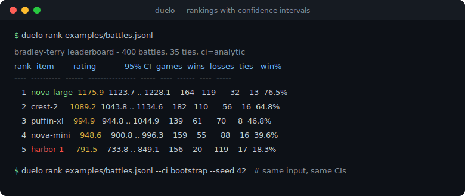
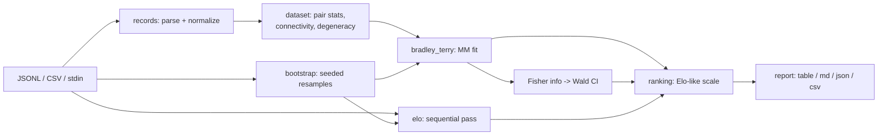

# duelo

[English](README.md) | [中文](README.zh.md) | [日本語](README.ja.md)

[](LICENSE) [](CHANGELOG.md) [](pyproject.toml)  [](CONTRIBUTING.md)

**Open-source Bradley-Terry and Elo rankings with confidence intervals from pairwise preference logs — offline ranking math over your own data, not a hosted arena.**



```bash
git clone https://github.com/JaydenCJ/duelo && cd duelo && pip install -e .
```

> **Pre-release:** duelo is not yet published to PyPI. Until the first release, clone [JaydenCJ/duelo](https://github.com/JaydenCJ/duelo) and run `pip install -e .` from the repository root. Zero runtime dependencies — `PYTHONPATH=src python3 -m duelo` works without installing anything.

## Why duelo?

Everyone runs arena-style pairwise comparisons internally — model A vs model B, prompt v1 vs v2, judged by humans or an LLM. Almost nobody turns those logs into rankings correctly: averaging win rates ignores who you played against, sequential Elo scripts give different answers depending on row order, and a leaderboard without confidence intervals invites decisions the data cannot support. The proper tool is the Bradley-Terry maximum-likelihood fit with real uncertainty — but reaching it usually means numpy/scipy notebooks copied from an arena repo. duelo is that math as a single zero-dependency CLI: point it at a JSONL or CSV log, get a readable leaderboard with analytic or bootstrap confidence intervals, and get told loudly when your data cannot support a ranking at all (shutouts, disconnected comparison graphs).

|  | duelo | choix | arena notebooks | trueskill |
|---|---|---|---|---|
| Confidence intervals on ratings | Yes (Wald + bootstrap) | No | Bootstrap (notebook code) | Per-player σ, not a CI |
| Order-independent fit over a full log | Yes (BT MLE) | Yes (BT MLE) | Yes | No (sequential updates) |
| Fit-health checks (shutouts, disconnected graphs) | Yes, typed errors + fix hint | No (silent divergence) | No | n/a |
| CLI with readable/markdown/JSON output | Yes | No (library only) | No (notebooks) | No (library only) |
| Runtime dependencies | 0 | numpy, scipy | pandas, numpy, plotly, ... | 0 |

<sub>Dependency counts are the declared runtime requirements as of 2026-07: choix 0.3.5 (numpy, scipy); "arena notebooks" refers to the analysis scripts published with arena-style leaderboards, which assume a pandas/numpy/plotly stack. duelo's count is `dependencies = []` in [pyproject.toml](pyproject.toml).</sub>

## Features

- **Correct math, checked against closed forms** — Bradley-Terry via Hunter's MM algorithm, ties counted as half a win per side, order-independent by construction; two-item fits and balanced-record standard errors are tested against exact analytic values.
- **Two kinds of confidence intervals** — analytic Wald intervals from the observed Fisher information (fast, symmetric), or seeded percentile bootstrap (asymmetric, captures small-sample skew); both on an Elo-like display scale you can re-anchor with `--base`/`--scale`.
- **Refuses to lie about ill-posed data** — items that won or lost everything, and comparison graphs split into disconnected leagues, raise typed errors naming the items and suggesting `--prior`, instead of emitting infinite or arbitrary ratings.
- **Deterministic and offline by design** — no network, no telemetry, no wall-clock; bootstrap draws come from `--seed` (default 42), so a leaderboard is exactly reproducible from its own JSON metadata.
- **Reads the logs you already have** — JSONL or CSV, auto-detected column aliases (`a`/`model_a`/`left`/...), arena-style winner values (`tie (bothbad)`), custom column names, stdin via `-`; malformed rows fail loudly with file and line number, never silently skipped.
- **Four views, four formats** — `rank` (BT), `elo` (sequential, when recency matters), `matrix` (exact W-L-T head-to-heads), `stats` (coverage and fit health), each rendering to aligned text, markdown, JSON, or CSV.
- **Zero runtime dependencies** — pure standard library, including the Gauss-Jordan matrix inverse behind the Fisher-information intervals; pytest is the only dev dependency.

## Quickstart

Install (or just use `PYTHONPATH=src` from a checkout):

```bash
git clone https://github.com/JaydenCJ/duelo && cd duelo && pip install -e .
```

Rank the bundled sample log — 400 simulated battles between five fictional models with known true strengths:

```bash
duelo rank examples/battles.jsonl
```

```text
bradley-terry leaderboard - 400 battles, 35 ties, ci=analytic
rank  item        rating            95% CI  games  wins  losses  ties   win%
----  ----------  ------  ----------------  -----  ----  ------  ----  -----
   1  nova-large  1175.9  1123.7 .. 1228.1    164   119      32    13  76.5%
   2  crest-2     1089.2  1043.8 .. 1134.6    182   110      56    16  64.8%
   3  puffin-xl    994.9   944.8 .. 1044.9    139    61      70     8  46.8%
   4  nova-mini    948.6    900.8 .. 996.3    159    55      88    16  39.6%
   5  harbor-1     791.5    733.8 .. 849.1    156    20     119    17  18.3%
```

(Real captured output. The true simulated order was nova-large > crest-2 > puffin-xl > nova-mini > harbor-1 — recovered exactly, and the overlapping CIs of `puffin-xl` and `nova-mini` correctly warn that third place is not settled.)

Your own log is one JSON object per line — `a`, `b`, and who won:

```jsonl
{"a": "prompt-v2", "b": "prompt-v1", "winner": "a"}
{"a": "prompt-v1", "b": "prompt-v3", "winner": "tie"}
```

Prefer bootstrap intervals, machine-readable output, or the same math as a library:

```bash
duelo rank battles.jsonl --ci bootstrap --rounds 500 --seed 42 --format json
```

```python
from duelo import load_battles, rank_bradley_terry

board = rank_bradley_terry(load_battles("battles.jsonl"), ci="bootstrap")
print(board.items[0].name, board.items[0].ci_low, board.items[0].ci_high)
```

## Commands and options

| Command | What it does |
|---|---|
| `duelo rank <log>` | Bradley-Terry leaderboard with confidence intervals (use this for a static log) |
| `duelo elo <log>` | Sequential Elo (order-dependent; use when recency should matter) |
| `duelo matrix <log>` | Head-to-head W-L-T matrix with exact integer counts |
| `duelo stats <log>` | Volume, pair coverage, connected components, degenerate items |

| Key | Default | Effect |
|---|---|---|
| `--ci` | `analytic` (rank), `bootstrap` (elo) | Interval method: `analytic`, `bootstrap`, or `none` |
| `--level` | `0.95` | Confidence level for either interval method |
| `--rounds` / `--seed` | `200` / `42` | Bootstrap resamples and RNG seed (reproducible) |
| `--prior` | `0` | Pseudo-ties added to every pair; repairs shutouts and disconnected graphs |
| `--base` / `--scale` | `1000` / `400` | Display scale: rating = base + scale·log10(strength ratio) |
| `--format` | `table` | Output: `table`, `markdown`, `json`, `csv` |
| `--col-a` / `--col-b` / `--col-winner` | auto-detect | Explicit column/key names for nonstandard logs |

Input formats and the JSON output schema are specified in [`docs/formats.md`](docs/formats.md); the estimation math (MM algorithm, Fisher information, bootstrap smoothing) is derived in [`docs/methodology.md`](docs/methodology.md).

## Verification

This repository ships no CI; every claim above is verified by local runs. Reproduce them from a checkout of this repository:

```bash
pip install -e '.[dev]' && pytest && bash scripts/smoke.sh
```

Output (copied from a real run, truncated with `...`):

```text
92 passed in 15.09s
...
[matrix] ace        -  14-5-2  10-3-1
SMOKE OK
```

## Architecture



## Roadmap

- [x] BT MLE fit, analytic + bootstrap CIs, sequential Elo, fit-health checks, 4 subcommands x 4 output formats (v0.1.0)
- [ ] PyPI release with `pip install duelo`
- [ ] Pairwise significance report: "is A > B?" p-values with multiple-comparison correction
- [ ] Davidson tie model as an alternative to ties-as-half-wins
- [ ] Time-sliced rankings (`--since`/`--window`) for drift tracking over long logs

See the [open issues](https://github.com/JaydenCJ/duelo/issues) for the full list.

## Contributing

Contributions are welcome — start with a [good first issue](https://github.com/JaydenCJ/duelo/issues?q=is%3Aissue+is%3Aopen+label%3A%22good+first+issue%22) or open a [discussion](https://github.com/JaydenCJ/duelo/discussions). See [CONTRIBUTING.md](CONTRIBUTING.md) for the development setup.

## License

[MIT](LICENSE)
