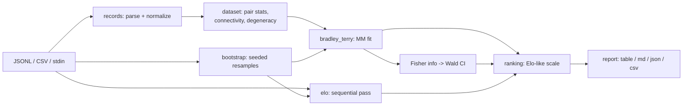

# duelo

[English](README.md) | [中文](README.zh.md) | [日本語](README.ja.md)

[](LICENSE) [](CHANGELOG.md) [](pyproject.toml)  [](CONTRIBUTING.md)

**开源的 Bradley-Terry 与 Elo 排名工具，从成对偏好日志计算带置信区间的排行榜——在你自己的数据上离线跑排名数学，而不是托管竞技场。**


```bash
git clone https://github.com/JaydenCJ/duelo && cd duelo && pip install -e .
```

> **预发布：** duelo 尚未发布到 PyPI。首个版本发布前，请克隆 [JaydenCJ/duelo](https://github.com/JaydenCJ/duelo) 并在仓库根目录执行 `pip install -e .`。运行时零依赖——不安装任何东西，`PYTHONPATH=src python3 -m duelo` 也能直接用。

## 为什么是 duelo？

每个团队内部都在跑竞技场式的成对比较——模型 A 对模型 B、提示词 v1 对 v2，由人类或 LLM 评判。但几乎没人把这些日志正确地变成排名：直接平均胜率忽略了对手是谁，顺序式 Elo 脚本换个行序就给出不同答案，而没有置信区间的排行榜会诱导数据根本撑不起的决策。正确的工具是带真实不确定性的 Bradley-Terry 最大似然拟合——但要用上它，通常得从某个竞技场仓库抄 numpy/scipy 笔记本。duelo 把这套数学做成一个零依赖 CLI：指向一份 JSONL 或 CSV 日志，得到可读的、带解析或 bootstrap 置信区间的排行榜；当数据根本无法支撑排名时（零封、比较图不连通），它会大声告诉你。

|  | duelo | choix | arena notebooks | trueskill |
|---|---|---|---|---|
| 评分的置信区间 | Yes (Wald + bootstrap) | No | Bootstrap (notebook code) | Per-player σ, not a CI |
| 全量日志上与顺序无关的拟合 | Yes (BT MLE) | Yes (BT MLE) | Yes | No (sequential updates) |
| 拟合健康检查（零封、图不连通） | Yes, typed errors + fix hint | No (silent divergence) | No | n/a |
| 可读/markdown/JSON 输出的 CLI | Yes | No (library only) | No (notebooks) | No (library only) |
| 运行时依赖 | 0 | numpy, scipy | pandas, numpy, plotly, ... | 0 |

<sub>依赖数量为 2026-07 查证的声明运行时依赖：choix 0.3.5（numpy、scipy）；"arena notebooks" 指竞技场式排行榜随附发布的分析脚本，默认 pandas/numpy/plotly 全家桶。duelo 的数字对应 [pyproject.toml](pyproject.toml) 中的 `dependencies = []`。</sub>

## 特性

- **正确的数学，用闭式解校验** —— Bradley-Terry 采用 Hunter 的 MM 算法，平局按每方半胜计，构造上与行序无关；双物品拟合与均衡战绩的标准误都用精确解析值做了测试。
- **两种置信区间** —— 基于观测 Fisher 信息的解析 Wald 区间（快、对称），或带种子的百分位 bootstrap（不对称，能捕捉小样本偏斜）；都落在类 Elo 展示刻度上，可用 `--base`/`--scale` 重新锚定。
- **拒绝在病态数据上说谎** —— 全胜或全败的物品、分裂成不连通联盟的比较图，都会抛出点名物品并提示 `--prior` 的类型化错误，而不是输出无穷大或随意的评分。
- **确定性、离线是设计前提** —— 无网络、无遥测、不依赖时钟；bootstrap 抽样由 `--seed`（默认 42）驱动，排行榜可从自身 JSON 元数据完全复现。
- **直接读你已有的日志** —— JSONL 或 CSV，自动识别列别名（`a`/`model_a`/`left`/...）、竞技场式胜者取值（`tie (bothbad)`）、自定义列名、`-` 读 stdin；格式坏行带文件与行号大声报错，绝不静默跳过。
- **四种视图、四种格式** —— `rank`（BT）、`elo`（顺序式，适合近因该起作用时）、`matrix`（精确 W-L-T 对战表）、`stats`（覆盖率与拟合健康），各自可渲染为对齐文本、markdown、JSON 或 CSV。
- **运行时零依赖** —— 纯标准库，连 Fisher 信息区间背后的 Gauss-Jordan 矩阵求逆也是；pytest 是唯一的开发依赖。

## 快速开始

安装（或直接在检出目录用 `PYTHONPATH=src`）：

```bash
git clone https://github.com/JaydenCJ/duelo && cd duelo && pip install -e .
```

给自带的样例日志排名——五个虚构模型之间的 400 场模拟对战，真实强度已知：

```bash
duelo rank examples/battles.jsonl
```

```text
bradley-terry leaderboard - 400 battles, 35 ties, ci=analytic
rank  item        rating            95% CI  games  wins  losses  ties   win%
----  ----------  ------  ----------------  -----  ----  ------  ----  -----
   1  nova-large  1175.9  1123.7 .. 1228.1    164   119      32    13  76.5%
   2  crest-2     1089.2  1043.8 .. 1134.6    182   110      56    16  64.8%
   3  puffin-xl    994.9   944.8 .. 1044.9    139    61      70     8  46.8%
   4  nova-mini    948.6    900.8 .. 996.3    159    55      88    16  39.6%
   5  harbor-1     791.5    733.8 .. 849.1    156    20     119    17  18.3%
```

（真实抓取的输出。模拟的真实排序是 nova-large > crest-2 > puffin-xl > nova-mini > harbor-1——被精确还原，且 `puffin-xl` 与 `nova-mini` 重叠的置信区间正确地警告：第三名尚无定论。）

你自己的日志就是每行一个 JSON 对象——`a`、`b`、谁赢了：

```jsonl
{"a": "prompt-v2", "b": "prompt-v1", "winner": "a"}
{"a": "prompt-v1", "b": "prompt-v3", "winner": "tie"}
```

想要 bootstrap 区间、机器可读输出，或把同一套数学当库用：

```bash
duelo rank battles.jsonl --ci bootstrap --rounds 500 --seed 42 --format json
```

```python
from duelo import load_battles, rank_bradley_terry

board = rank_bradley_terry(load_battles("battles.jsonl"), ci="bootstrap")
print(board.items[0].name, board.items[0].ci_low, board.items[0].ci_high)
```

## 命令与选项

| 命令 | 作用 |
|---|---|
| `duelo rank <log>` | 带置信区间的 Bradley-Terry 排行榜（静态日志用这个） |
| `duelo elo <log>` | 顺序式 Elo（依赖行序；近因该起作用时用） |
| `duelo matrix <log>` | 精确整数计数的 W-L-T 对战矩阵 |
| `duelo stats <log>` | 数据量、配对覆盖率、连通分量、退化物品 |

| Key | Default | Effect |
|---|---|---|
| `--ci` | `analytic`（rank）、`bootstrap`（elo） | 区间方法：`analytic`、`bootstrap` 或 `none` |
| `--level` | `0.95` | 两种区间方法共用的置信水平 |
| `--rounds` / `--seed` | `200` / `42` | bootstrap 重采样次数与 RNG 种子（可复现） |
| `--prior` | `0` | 给每一对物品加伪平局；修复零封与不连通的比较图 |
| `--base` / `--scale` | `1000` / `400` | 展示刻度：rating = base + scale·log10(强度比) |
| `--format` | `table` | 输出：`table`、`markdown`、`json`、`csv` |
| `--col-a` / `--col-b` / `--col-winner` | 自动识别 | 为非标准日志显式指定列/键名 |

输入格式与 JSON 输出 schema 见 [`docs/formats.md`](docs/formats.md)；估计所用的数学（MM 算法、Fisher 信息、bootstrap 平滑）推导见 [`docs/methodology.md`](docs/methodology.md)。

## 验证

本仓库不带 CI；上述每一条主张都由本地运行验证。从本仓库的检出即可复现：

```bash
pip install -e '.[dev]' && pytest && bash scripts/smoke.sh
```

输出（拷贝自真实运行，用 `...` 截断）：

```text
92 passed in 15.09s
...
[matrix] ace        -  14-5-2  10-3-1
SMOKE OK
```

## 架构



## 路线图

- [x] BT MLE 拟合、解析 + bootstrap 置信区间、顺序式 Elo、拟合健康检查、4 个子命令 x 4 种输出格式（v0.1.0）
- [ ] 发布到 PyPI，支持 `pip install duelo`
- [ ] 成对显著性报告："A 是否 > B？"的 p 值，带多重比较校正
- [ ] Davidson 平局模型，作为平局按半胜计的替代方案
- [ ] 时间切片排名（`--since`/`--window`），跟踪长日志中的漂移

完整列表见 [open issues](https://github.com/JaydenCJ/duelo/issues)。

## 贡献

欢迎贡献——从一个 [good first issue](https://github.com/JaydenCJ/duelo/issues?q=is%3Aissue+is%3Aopen+label%3A%22good+first+issue%22) 开始，或发起一个 [discussion](https://github.com/JaydenCJ/duelo/discussions)。开发环境搭建见 [CONTRIBUTING.md](CONTRIBUTING.md)。

## 许可证

[MIT](LICENSE)
